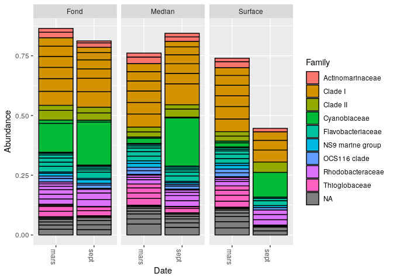

Analyse\_phyloseq\_des\_donnees\_de\_la\_rade\_de\_Brest
================

  - [Appel des packages](#appel-des-packages)
  - [Combiner les données dans un objet
    phyloseq](#combiner-les-données-dans-un-objet-phyloseq)
  - [Indices d’alpha-diversité](#indices-dalpha-diversité)
  - [Filtration des taxonomies](#filtration-des-taxonomies)
  - [Filtrage de la prévalence](#filtrage-de-la-prévalence)
      - [Première PCoA (Analyse en Composantes
        Principales)](#première-pcoa-analyse-en-composantes-principales)
  - [Histogrammes des abondances](#histogrammes-des-abondances)
      - [Abondances des différentes familles en fonction de la date et
        de la
        profondeur](#abondances-des-différentes-familles-en-fonction-de-la-date-et-de-la-profondeur)
      - [Abondances des différents genres en fonction de la date et de
        la
        profondeur](#abondances-des-différents-genres-en-fonction-de-la-date-et-de-la-profondeur)

1/ quelles sont les influences relatives de la profondeur et de la
saison sur la structure des communautes planctoniques de la rade de
Brest ? -\> Shannon et Simpson seraient plutôt utilisés comme indice. On
pourrait aussi utiliser l’ordination. 2/ Quels sont les biomarqueurs de
saison (hiver et ete) ?

``` r
load("01_data_analysis_FinalEnv")
```

# Appel des packages

``` r
library(phyloseq)
library(Biostrings)
```

    ## Loading required package: BiocGenerics

    ## Loading required package: parallel

    ## 
    ## Attaching package: 'BiocGenerics'

    ## The following objects are masked from 'package:parallel':
    ## 
    ##     clusterApply, clusterApplyLB, clusterCall, clusterEvalQ,
    ##     clusterExport, clusterMap, parApply, parCapply, parLapply,
    ##     parLapplyLB, parRapply, parSapply, parSapplyLB

    ## The following objects are masked from 'package:stats':
    ## 
    ##     IQR, mad, sd, var, xtabs

    ## The following objects are masked from 'package:base':
    ## 
    ##     anyDuplicated, append, as.data.frame, basename, cbind, colnames,
    ##     dirname, do.call, duplicated, eval, evalq, Filter, Find, get, grep,
    ##     grepl, intersect, is.unsorted, lapply, Map, mapply, match, mget,
    ##     order, paste, pmax, pmax.int, pmin, pmin.int, Position, rank,
    ##     rbind, Reduce, rownames, sapply, setdiff, sort, table, tapply,
    ##     union, unique, unsplit, which, which.max, which.min

    ## Loading required package: S4Vectors

    ## Loading required package: stats4

    ## 
    ## Attaching package: 'S4Vectors'

    ## The following object is masked from 'package:base':
    ## 
    ##     expand.grid

    ## Loading required package: IRanges

    ## 
    ## Attaching package: 'IRanges'

    ## The following object is masked from 'package:phyloseq':
    ## 
    ##     distance

    ## Loading required package: XVector

    ## 
    ## Attaching package: 'Biostrings'

    ## The following object is masked from 'package:base':
    ## 
    ##     strsplit

``` r
library(ggplot2)
```

# Combiner les données dans un objet phyloseq

Par exemple, la fonction data.frame permet de créer des cadres de
données en couplant des variables qui partagent des propriétés de
matrice et de liste.

``` r
samples.out <- rownames(seqtab.nochim)
profondeur <- sapply(strsplit(samples.out, "D"), `[`, 1)
date <- substr(profondeur,0,11)
samdf <- data.frame(Profondeur=profondeur, Date=date)
samdf$Profondeur[samdf$Date>11] <- c("Fond","Median","Surface")
```

    ## Warning in samdf$Profondeur[samdf$Date > 11] <- c("Fond", "Median", "Surface"):
    ## number of items to replace is not a multiple of replacement length

``` r
samdf$Date[samdf$Profondeur>11] <- c("mars","sept")
```

    ## Warning in samdf$Date[samdf$Profondeur > 11] <- c("mars", "sept"): number of
    ## items to replace is not a multiple of replacement length

``` r
rownames(samdf) <- samples.out
```

On crée ici un fichier csv afin d’ordonner les paramètres, tels que les
mois et la profondeur.

``` r
write.csv(samdf,"samdf.csv")
```

On importe ici notre jeu de données dans l’objet samdf précédemment
crée. Ce fichier comprend les informations de la rade de Brest, et
notamment les dates et les profondeurs d’échantillonnage. Elles nous
permettront de discriminer dans notre étude.

``` r
samdf <-read.table('~/CC2EcoG2/samdf.csv', sep=',', header=TRUE, row.names=1)
```

L’objet ps que l’on crée ici rassemble les objets précédents nous
renseignant sur l’assignation taxonomique et le nombre de séquences
identifiées, et ce pour chaque échantillon.

``` r
library(phyloseq)
ps <- phyloseq(otu_table(seqtab.nochim, taxa_are_rows=FALSE), 
               sample_data(samdf), 
               tax_table(taxa))
ps
```

    ## phyloseq-class experiment-level object
    ## otu_table()   OTU Table:         [ 1557 taxa and 11 samples ]
    ## sample_data() Sample Data:       [ 11 samples by 2 sample variables ]
    ## tax_table()   Taxonomy Table:    [ 1557 taxa by 6 taxonomic ranks ]

Cela signifie donc que l’objet ps comporte 1557 taxons répartis sur 11
échantillons. Ces 11 échantillons ont chacun 2 variables.

# Indices d’alpha-diversité

On se base ici sur l’objet ps précédemment créé pour construire notre
graphique.

``` r
plot_richness(ps, x="Date", measures=c("Shannon", "Simpson"), color="Profondeur")
```

<!-- -->

On sait que l’indice de Shannon permet de donner des informations sur la
structure et la richesse des communautés. De plus, il permet de
visualiser les “bruits” (soit les incertitudes) de nos échantillons. De
même, l’indice de Simpson prend également en compte la richesse et la
régularité. On peut donc différencier de plusieurs façons les périodes
de mars et septembre. Premièrement, on peut dire que les communautés
bactériennes sont beaucoup plus diversifier dans les fonds. Ensuite, il
semble y avoir une corrélation une corrélation entre la profondeur et la
richesse en saison estivale. En effet, on peut voir que les communautés
bactériennes sont beaucoup plus diversifiées dans les fonds que en
surface.

# Filtration des taxonomies

La fonction rank\_names permet de rendre compte des rangs taxonomiques
disponibles dans l’objet ps.

``` r
rank_names(ps)
```

    ## [1] "Kingdom" "Phylum"  "Class"   "Order"   "Family"  "Genus"

``` r
table(tax_table(ps)[, "Phylum"], exclude = NULL)
```

    ## 
    ##              Actinobacteriota                  Bacteroidota 
    ##                            22                           238 
    ##              Bdellovibrionota              Campilobacterota 
    ##                            35                             1 
    ##                   Chloroflexi                 Crenarchaeota 
    ##                            21                             6 
    ##                 Cyanobacteria                  Dadabacteria 
    ##                           142                             3 
    ##                  Dependentiae              Desulfobacterota 
    ##                             1                             8 
    ##               Elusimicrobiota                Fibrobacterota 
    ##                             1                             2 
    ##               Gemmatimonadota               Hydrogenedentes 
    ##                             7                             1 
    ##              Margulisbacteria Marinimicrobia (SAR406 clade) 
    ##                            23                            82 
    ##                   Myxococcota                         NB1-j 
    ##                             4                             2 
    ##                  Nitrospinota                       PAUC34f 
    ##                            20                             3 
    ##               Planctomycetota                Proteobacteria 
    ##                            32                           786 
    ##  SAR324 clade(Marine group B)              Thermoplasmatota 
    ##                            16                            18 
    ##             Verrucomicrobiota                          <NA> 
    ##                            71                            12

On observe ici les différents phyla de l’objet phyloseq. Ainsi, il
semble donc que les protéobactéries soient les plus abondantes avec 786
occurences. Ensuite, de la même façon, on peut retrouver les
Bacteroidota avec 238 occurences, et les cyanobactéries avec 142
occurrences.

``` r
ps <- subset_taxa(ps, !is.na(Phylum) & !Phylum %in% c("", "uncharacterized"))
```

``` r
# Calculer la prévalence de chaque caractéristique, stocker sous forme de data.frame
prevdf = apply(X = otu_table(ps),
               MARGIN = ifelse(taxa_are_rows(ps), yes = 1, no = 2),
               FUN = function(x){sum(x > 0)})
# Ajoutez la taxonomie et le nombre total de lectures à ces données.
prevdf = data.frame(Prevalence = prevdf,
                    TotalAbundance = taxa_sums(ps),
                    tax_table(ps))
```

La fonction plyr permet de séparer les différentes données. De ce fait,
la colonne 1 correspond aux estimations d’abondances, et la 2 aux
abondances observées. On effectue donc ici des estimations d’abondance.

``` r
plyr::ddply(prevdf, "Phylum", function(df1){cbind(mean(df1$Prevalence),sum(df1$Prevalence))})
```

    ##                           Phylum        1    2
    ## 1               Actinobacteriota 3.727273   82
    ## 2                   Bacteroidota 3.978992  947
    ## 3               Bdellovibrionota 2.342857   82
    ## 4               Campilobacterota 2.000000    2
    ## 5                    Chloroflexi 4.238095   89
    ## 6                  Crenarchaeota 4.500000   27
    ## 7                  Cyanobacteria 3.204225  455
    ## 8                   Dadabacteria 4.666667   14
    ## 9                   Dependentiae 1.000000    1
    ## 10              Desulfobacterota 2.000000   16
    ## 11               Elusimicrobiota 1.000000    1
    ## 12                Fibrobacterota 2.500000    5
    ## 13               Gemmatimonadota 2.428571   17
    ## 14               Hydrogenedentes 1.000000    1
    ## 15              Margulisbacteria 1.826087   42
    ## 16 Marinimicrobia (SAR406 clade) 4.414634  362
    ## 17                   Myxococcota 2.750000   11
    ## 18                         NB1-j 1.500000    3
    ## 19                  Nitrospinota 3.950000   79
    ## 20                       PAUC34f 3.333333   10
    ## 21               Planctomycetota 3.437500  110
    ## 22                Proteobacteria 4.296438 3377
    ## 23  SAR324 clade(Marine group B) 4.687500   75
    ## 24              Thermoplasmatota 2.722222   49
    ## 25             Verrucomicrobiota 3.788732  269

Cela nous permet de visualiser si tel ou tel phyla est retrouvé dans de
nombreux échantillons et en quelle proportion. Ces résultats montrent
bien que les protéobactéries sont extrêmement présentes, de même que les
Bacteroidota et les cyanobactéries.

# Filtrage de la prévalence

``` r
# Subset to the remaining phyla
prevdf1 = subset(prevdf, Phylum %in% get_taxa_unique(ps, "Phylum"))
ggplot(prevdf1, aes(TotalAbundance, Prevalence / nsamples(ps),color=Phylum)) +
  # Inclure une estimation pour le paramètre
  geom_hline(yintercept = 0.05, alpha = 0.5, linetype = 2) +  geom_point(size = 2, alpha = 0.7) +
  scale_x_log10() +  xlab("Total Abundance") + ylab("Prevalence [Frac. Samples]") +
  facet_wrap(~Phylum) + theme(legend.position="none")
```

<!-- -->

Ces graphiques nous montrent la prévalence des phyla en fonction de leur
abondance totale. Comme vu précédemment, les protéobactéries, ainsi que
les Bacteroidota, ou encore les cyanobactéries, sont retrouvés en forte
abondance. Toutefois, ce type de graphique ne nous permet pas de
discriminer nos échantillons par la période de l’année.

## Première PCoA (Analyse en Composantes Principales)

NB : Pour créer une DPCoA, on aurait eu besoin de l’arbre
phylogénétique. Ici, nous avons effectué une ordination par PCoA avec
l’indice de dissimilarité de Bray-Curtis. Il permet d’évaluer la
distance, soit la dissimilarité entre deux échantillons.

``` r
pslog <- transform_sample_counts(ps, function(x) log(1 + x))
out.wuf.log <- ordinate(pslog, method = "PCoA", distance = "bray")
```

``` r
evals <- out.wuf.log$values$Eigenvalues
plot_ordination(pslog, out.wuf.log, color = "Profondeur", shape="Date") +
  labs(col = "Profondeur",shape= "Date")
```

<!-- -->

L’axe 1 traduit la distribution entre deux saisons. L’axe 2 traduit la
distribution au sein d’une même saison. On observe une grande différence
entre la distribution des données de mars (ronds) et de septembre
(triangles). Il semble donc n’y avoir pas de “cohabitation” entre les
communautés bactériennes en septembre (été) et en mars (hiver). En
effet, au niveau de l’axe 1, on peut voir qu’on a une certaine
répartition des phyla au niveau des profondeurs. Ensuite, on peut
également relever des différences entre les différentes profondeurs par
rapport à leur date. Par exemple, les populations bactériennes se
différencient beaucoup plus en été. On peut donc dire que la saison
influe plus sur la répartion des communautés bactériennes que la
profondeur.

# Histogrammes des abondances

## Abondances des différentes familles en fonction de la date et de la profondeur

``` r
top20 <- names(sort(taxa_sums(ps), decreasing=TRUE))[1:20]
ps.top20 <- transform_sample_counts(ps, function(OTU) OTU/sum(OTU))
ps.top20 <- prune_taxa(top20, ps.top20)
plot_bar(ps.top20, x="Date", fill="Family") + facet_wrap(~Profondeur, scales="free_x")
```

<!-- -->

On peut observer les différentes familles marqué par les différences de
couleurs. Il semble donc que la clade I soit la famille majoritaire pour
chacune des conditions étudiées. Toutefois, on pourrait aussi citer les
Cyanobiaceae comme famille particulièrement présente, et notamment au
niveau médian et à la surface en période estivale. Par ailleurs, on peut
noter l’influence de la profondeur sur la diversité, la structure des
communautés et l’abondance bactérienne.

## Abondances des différents genres en fonction de la date et de la profondeur

``` r
top20 <- names(sort(taxa_sums(ps), decreasing=TRUE))[1:20]
ps.top20 <- transform_sample_counts(ps, function(OTU) OTU/sum(OTU))
ps.top20 <- prune_taxa(top20, ps.top20)
plot_bar(ps.top20, x="Date", fill="Genus") + facet_wrap(~Profondeur, scales="free_x")
```

<!-- -->

Ce graphique là permet de préciser le type de biomarqueur que l’on
pourrait utiliser. On peut constater que le genre de la Clade Ia
prédomine presque partout, à l’exception de la surface en septembre
(été). On peut de ce fait voir que Synechococcus CC9902 prédomine au
niveau de la surface en période estivale. Par ailleurs, on remarque qu’à
chaque profondeur l’abondance totale est moindre en période hivernale.
Dès lors, on pourrait éventuellement utiliser Synechococcus en tant que
biomarqueur pour la période estivale au niveau médian et à la surface.
Néanmoins, on ne peut pas conclure quant à un biomarqueur pour la
période hivernale car la Clade Ia est présente chez les deux saisons
étudiées.
